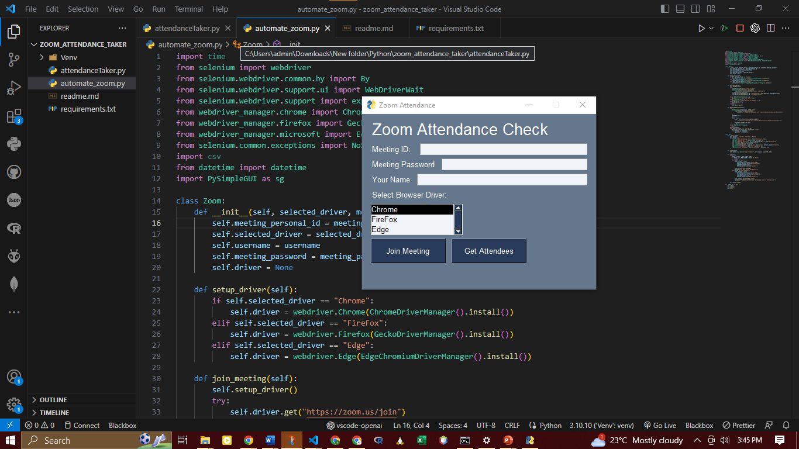

# Zoom Attendance Automation with Python
Automate the process of joining Zoom meetings and fetching attendees' list with this Python script! Say goodbye to manual attendance tracking and streamline your Zoom experience.


## Introduction
Zoom Attendance Automation is a Python script that leverages Selenium and PySimpleGUI libraries to provide an elegant and user-friendly interface for automating the process of joining Zoom meetings and fetching the list of attendees. The script simplifies attendance tracking, eliminates manual efforts, and saves time during virtual meetings.

## Features
Join Zoom meetings seamlessly with a few clicks.
Fetch the list of attendees and save it to a CSV file for easy record-keeping.
Modern and elegant graphical user interface (GUI) for user input collection.
Flexible and adaptable to different web browsers (Chrome, Firefox, Edge).
### Prerequisites
Before using the Zoom Attendance Automation script, make sure you have the following prerequisites installed on your system:

**Python 3.x**
**Selenium** (pip install selenium)
**PySimpleGUI** (pip install PySimpleGUI)
**ChromeDriver** (for Chrome) or GeckoDriver (for Firefox) or EdgeDriver (for Edge)

### Installation
Clone this GitHub repository to your local machine:
```
git clone https://github.com/kram254/Zoom-Attendance-Automation.git
```
Change to the project directory:
```
cd zoom-attendance-automation
```

Install the required Python packages:
```
pip install -r requirements.txt
```
Download the appropriate web driver executable for your preferred web browser and add it to your system's PATH.


## Usage
To use the Zoom Attendance Automation script, follow these steps:

Run the Python script:
```
python automate_zoom.py
```
The PySimpleGUI-based graphical user interface (GUI) will appear, allowing you to enter the meeting details (meeting ID, meeting password, and your name) and select the web browser driver (Chrome, Firefox, or Edge).

Click the ```Join Meeting``` button to automatically join the Zoom meeting using the provided details.

To fetch the attendees' list, click the "Get Attendees" button. The list will be saved in a CSV file named "attended.csv" in the project directory.

### Technologies Used
Python
Selenium
PySimpleGUI


## Contributing
Contributions are welcome! If you have any suggestions, bug reports, or feature requests, please open an issue or submit a pull request. Let's improve this project together!

## License
This project is licensed under the MIT License. See the LICENSE file for details.

Thank you for exploring the Zoom Attendance Automation project! If you find it useful, don't forget to give it a ⭐️ and share it with others. Happy automating! 🚀🎉


